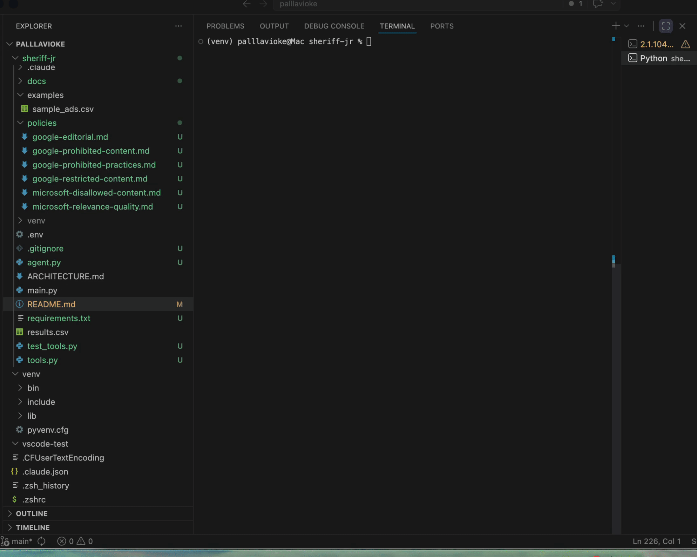
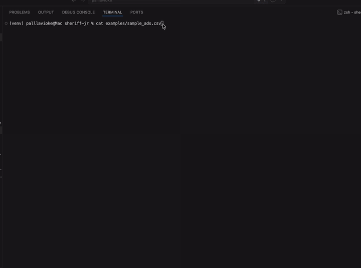

# PolicyPilot — An agentic ad compliance reviewer built with Claude





---

## The Problem

Performance marketing teams bid on thousands of keywords daily — each one needs to be vetted against Google Ads and Microsoft Advertising policies that change without notice and differ across content categories. Manual review is slow, inconsistent, and impossible to scale. A keyword that was clean last quarter can become a policy violation today, and a disapproved ad wastes budget and tanks Quality Score while you wait for a human reviewer to tell you why.

PolicyPilot is the tool I built to automate that loop: give it an ad, a keyword, or a landing page URL, and it reads the actual current policy documents before deciding whether there's a problem.

---

## Demo

```
$ python main.py check --ad "Lose 30 pounds in 30 days, guaranteed!"

Running compliance review…

[tool] fetch_policy_page(policy_name='google-prohibited-content')
[tool] fetch_policy_page(policy_name='google-prohibited-practices')
[tool] fetch_policy_page(policy_name='google-restricted-content')
[tool] fetch_policy_page(policy_name='google-editorial')
[tool] fetch_policy_page(policy_name='microsoft-disallowed-content')
[tool] fetch_policy_page(policy_name='microsoft-relevance-quality')

╭──────────────────── Sheriff Jr. Compliance Report ────────────────────╮
│ LIKELY VIOLATION                                                       │
│ Ad makes an unrealistic weight-loss claim with an unsubstantiated      │
│ guarantee, violating Google editorial and Microsoft quality rules.     │
╰────────────────────────────────────────────────────────────────────────╯

  3 issue(s) found
  ┌─────────────────────────────┬──────────────────────────────┬──────┐
  │ Policy                      │ Offending Text               │ Sev. │
  ├─────────────────────────────┼──────────────────────────────┼──────┤
  │ google-editorial            │ Lose 30 pounds in 30 days,   │ HIGH │
  │                             │ guaranteed!                  │      │
  ├─────────────────────────────┼──────────────────────────────┼──────┤
  │ microsoft-relevance-quality │ guaranteed!                  │ HIGH │
  ├─────────────────────────────┼──────────────────────────────┼──────┤
  │ google-restricted-content   │ Lose 30 pounds in 30 days    │  MED │
  └─────────────────────────────┴──────────────────────────────┴──────┘
```

---

## What PolicyPilot Does

- Reviews ad copy, keywords, and landing page URLs — any combination of the three
- Fetches all six Google Ads and Microsoft Advertising policy documents on every run — never relies on cached or stale knowledge
- Returns a structured verdict (`clean` / `at_risk` / `likely_violation`) with per-issue severity, the exact offending text, and a ready-to-paste suggested rewrite
- Supports **batch CSV processing** — review an entire campaign export in one command with a live progress bar and summary counts
- Color-coded terminal output: red for violations, yellow for at-risk, green for clean

---

## How It Works

```
┌─────────────────┐     ┌──────────────────────────────────┐     ┌──────────────────┐
│   CLI (Click)   │────▶│          Agent Loop              │────▶│      Tools       │
│                 │     │                                  │     │                  │
│  --ad           │     │  1. Build user message           │     │ fetch_policy_page│
│  --keyword      │     │  2. POST to Claude API           │◀───▶│   (6 policies)   │
│  --landing-page │     │  3. On tool_use: dispatch        │     │                  │
│  --json-out     │     │     tool, append result          │     │ fetch_url        │
│                 │     │  4. On end_turn: parse JSON       │     │  (landing pages) │
│  batch --input  │     │  5. Return structured dict       │     │                  │
└─────────────────┘     └──────────────────────────────────┘     └──────────────────┘
                                        ▲
                                        │  Claude API
                                        │  tool-use loop
                                        ▼
                              claude-sonnet-4-5
```

The agent loop is the core of the project. On each iteration, Claude either requests a tool call (fetching a policy page or a landing page) or returns a final answer. The loop dispatches tool calls, feeds results back, and continues until Claude signals `end_turn` with a structured JSON verdict. A cap of 10 iterations prevents runaway agents.

The key design constraint: Claude is instructed — via the system prompt — to always call `fetch_policy_page` for all six policies before rendering a judgment, and to always call `fetch_url` if a landing page is given. This means the agent reasons over current policy text, not training-data snapshots.

---

## Quickstart

```bash
# 1. Clone and install
git clone https://github.com/pallavi-oke/sheriff-jr.git
cd sheriff-jr
pip install -r requirements.txt

# 2. Add your Anthropic API key
echo "ANTHROPIC_API_KEY=sk-ant-..." > .env

# 3. Review an ad
python main.py check --ad "Best weight loss supplement — doctors hate this trick"
```

---

## Example Runs

### Clean

```bash
$ python main.py check --ad "Try ProjectFlow — project management for modern teams" \
    --keyword "project flow" --json-out
```

```json
{
  "overall_verdict": "clean",
  "summary": "Ad copy is compliant with Google Ads and Microsoft Advertising policies; project management software is clearly described with no prohibited or restricted content.",
  "issues": []
}
```

### At Risk

```bash
$ python main.py check --ad "Open a high-yield savings account today — 5% APY, FDIC insured" \
    --json-out
```

```json
{
  "overall_verdict": "at_risk",
  "summary": "Financial services ad with rate claim requires landing page verification to ensure all regulatory disclosures are present and APY is accurate.",
  "issues": [
    {
      "policy": "google-restricted-content",
      "offending_text": "5% APY",
      "severity": "medium",
      "explanation": "Financial product rate claims must match landing page exactly and comply with country-specific disclosure requirements.",
      "suggested_rewrite": "High-yield savings account — competitive rates, FDIC insured (add disclaimer on landing page)"
    },
    {
      "policy": "google-editorial",
      "offending_text": "5% APY",
      "severity": "medium",
      "explanation": "Specific rate claims must be substantiated and match landing page availability; should include indicator that terms apply.",
      "suggested_rewrite": "Open a high-yield savings account today — up to 5% APY*, FDIC insured (*terms apply)"
    }
  ]
}
```

### Likely Violation

```bash
$ python main.py check --ad "Buy cheap Xanax without a prescription — shipped overnight" \
    --json-out
```

```json
{
  "overall_verdict": "likely_violation",
  "summary": "This ad violates Google and Microsoft policies by promoting the sale of prescription drugs without authorization and encouraging users to bypass legal prescription requirements.",
  "issues": [
    {
      "policy": "google-prohibited-content",
      "offending_text": "Buy cheap Xanax without a prescription",
      "severity": "high",
      "explanation": "Google prohibits ads that facilitate the sale of prescription drugs without proper authorization; Xanax is a Schedule IV controlled substance requiring a prescription.",
      "suggested_rewrite": "This ad cannot be made compliant — Xanax requires a valid prescription and online pharmacies must be LegitScript-certified to advertise on Google."
    },
    {
      "policy": "microsoft-disallowed-content",
      "offending_text": "Buy cheap Xanax without a prescription",
      "severity": "high",
      "explanation": "Microsoft prohibits ads for products illegal in the targeted location; selling prescription medications without a prescription is illegal in all jurisdictions.",
      "suggested_rewrite": "This ad cannot be made compliant — selling prescription drugs without a prescription violates federal and state pharmacy laws."
    }
  ]
}
```

---

## Batch Mode

Review an entire campaign CSV in one command:

```bash
python main.py batch --input examples/sample_ads.csv --output results.csv

# Test on the first 3 rows before running the full file
python main.py batch --input examples/sample_ads.csv --output results.csv --limit 3
```

Input CSV columns: `ad`, `keyword`, `landing_page` (any may be empty per row). Output columns: `verdict`, `summary`, `issue_count`, `issues_json`, `error`.

See [`examples/sample_ads.csv`](examples/sample_ads.csv) for a starter set that covers all three verdict tiers.

---

## What I Learned

**Curating policies locally worked better instead of website scrapping.** 
My first version scrapped Google's and Microsoft's policy pages on every run, but those pages load their content with JavaScript, so all I got back was menu text. Switching to a small folder of markdown summaries manually curated based on the official policy content pages made the agent functional, at the cost of needing to refresh them when policies change.

**Tool descriptions mattered more than the system prompt.** PolicyPilot kept skipping policies it decided weren't relevant until I rewrote the `fetch_policy_page` description to say "call this before making any judgment" and list the six policies explicitly. 

**Structured JSON output made everything else easier.** Defining structured response output helped the agent to return a fixed schema. This meant I can pipe results into Slack or a dashboard later.

**Start with single-ad mode before batch mode.** Validating PolicyPilot's judgment on one ad at a time allowed me to test agent reasoning end to end fully before building the batch mode support.

---

## Future Work

- Add Meta and TikTok ad policies to the corpus
- Image and video ad review (multimodal input)
- Google Ads API integration — pull live campaigns directly instead of requiring a CSV export
- Concurrent batch processing to cut review time on large files
- Confidence scores alongside severity to surface "probably fine but worth a human look" cases
- Slack / webhook integration to pipe violation alerts into existing review workflows

---

## Tech Stack

Python · Anthropic Claude Sonnet (claude-sonnet-4-5) · Claude tool-use API · Click · Rich · BeautifulSoup · python-dotenv
